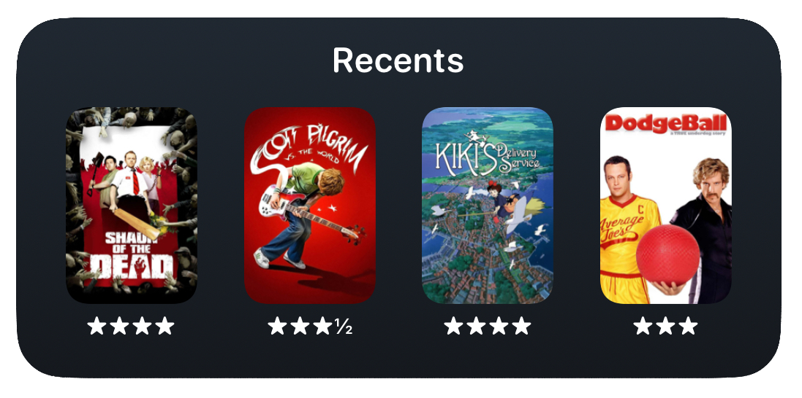
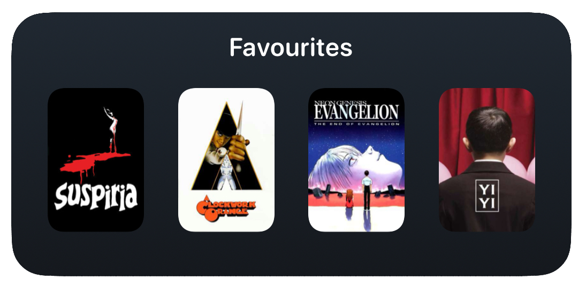

# LetterboxdWidgets
Widgets for Letterboxd using [Scriptable](https://itunes.apple.com/app/id1405459188). To use:
1. Download Scriptable from the App Store.
2. Create a new script and paste the code for the widget you've chosen (one of the .js files here) into the text field.
3. Follow any setup steps I've given below for your widget.
4. On your home screen, add a widget of the correct size from Scriptable and set the script to the one you created.
5. Give the widget a moment to load, and you're done!

Note: Widgets require the app they're run from to be opened before opening other apps. This is currently impossible to circumvent. So, when you click on the widget, it will open Scriptable before redirecting to Letterboxd.

# Recents

Displays your 4 most recent films watched (and their ratings) in a medium sized widget.

Setup: Replace `'your_username'` in the first line with your Letterboxd username.

# Favourites

Displays your top 4 favourite films in a medium sized widget.

Setup: Replace `'your_username'` in the first line with your Letterboxd username.

# To Do List:
- [ ] Create core script to reduce duplicate code.
- [ ] Add more options for scripts - custom widget update timers, more control over UI, etc.
